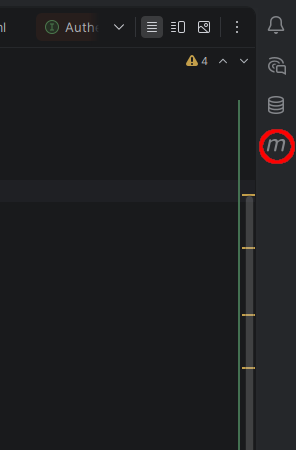
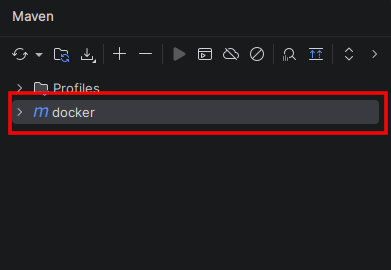
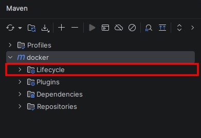
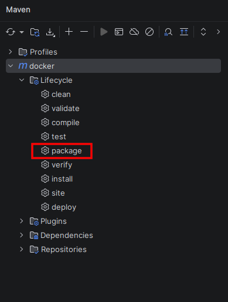

# spring-docker
a simple spring project which implements spring security that wrapped by docker-compose

## Run the project

### 1.Build JAR file
Before run the containers it's necessary to build the project:

#### Step 1

#### Step 2

#### Step 3

#### Step 4

### 2. Run via Docker compose
Run the bundle of the application and the database:
bash
docker compose up --build

The application will be available in the address: http://localhost:8080
The database (Postgres) is available locally on the port: 5433

